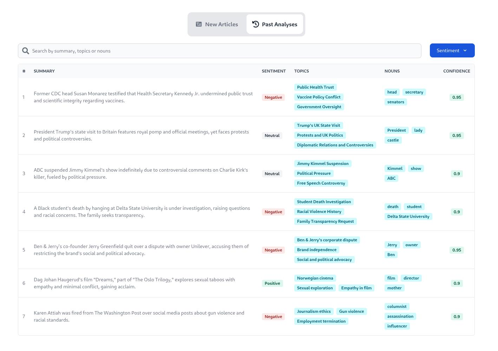

### About

**Tech Stack**: `TypeScript`, `Google Gemini SDK`, `Supabase`, `Next.JS`, `TailwindCSS`, `Flowbite`, `Axios`

**AI Knowledge Extractor** - uses Google Gemini TypeScript API to parse articles/blogs in a structured format, extract and store these in a Supabase database:

- Summary of the text in 1 or 2 short sentences;
- Sentiment of the given text (Negative, Neutral, Positive);
- An array of top 3 key topics;
- An array of all nouns;
- A floating-point value between 0 and 1 that represents how confident the AI model is in its prediction;

### Live Demo

You can play with the app on Netlify: https://ai-knowledge-extractor.netlify.app/

### Video Demo ([Click to watch](./public/demo.mp4))

[Click to watch the video]()

[](./public/demo.mp4)

### Running locally

```bash
yarn
yarn dev
```

Copy and paste the `.env.example` file, rename it to `.env`, and fill it with all the necessary environment variables.

Open [http://localhost:3000](http://localhost:3000) with your browser to see the result.
